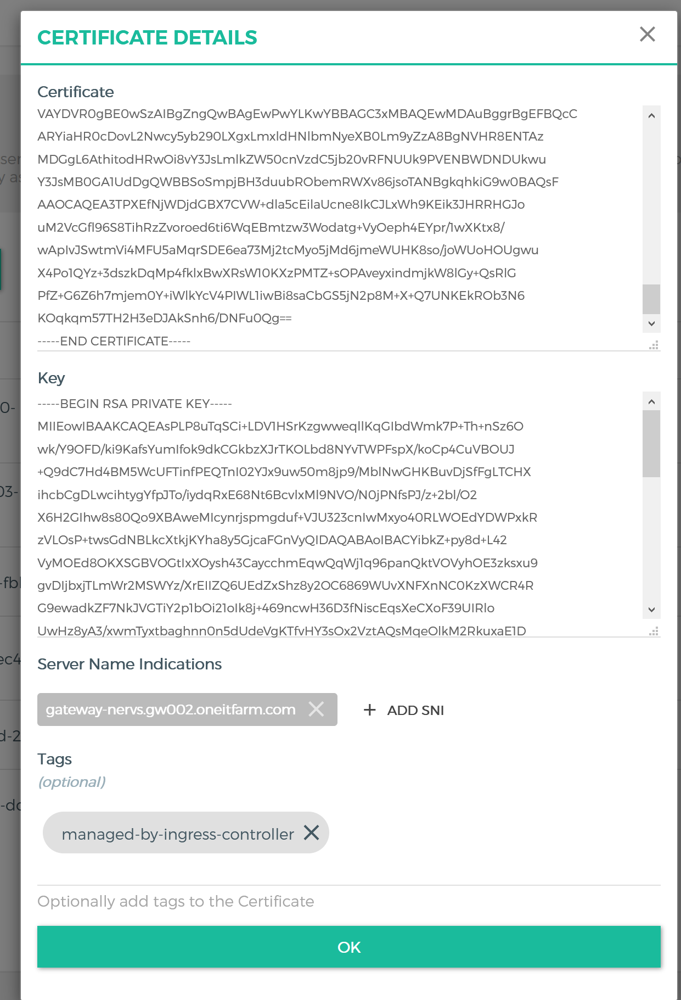
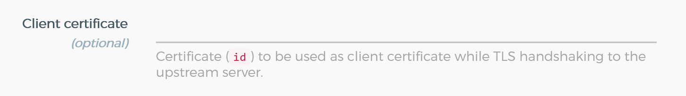
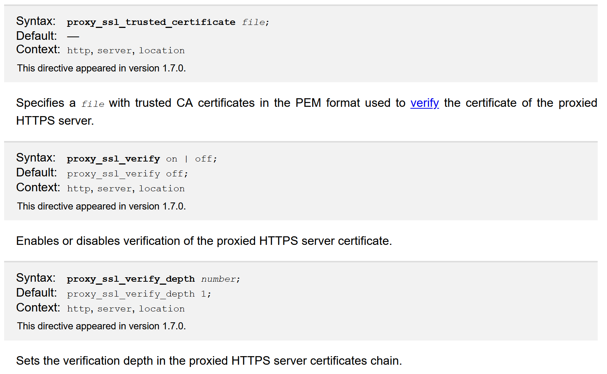
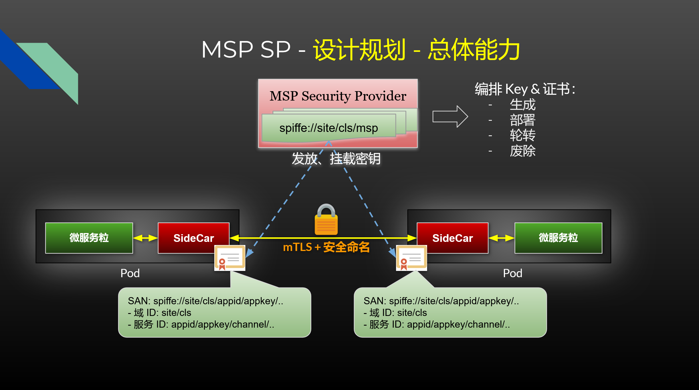
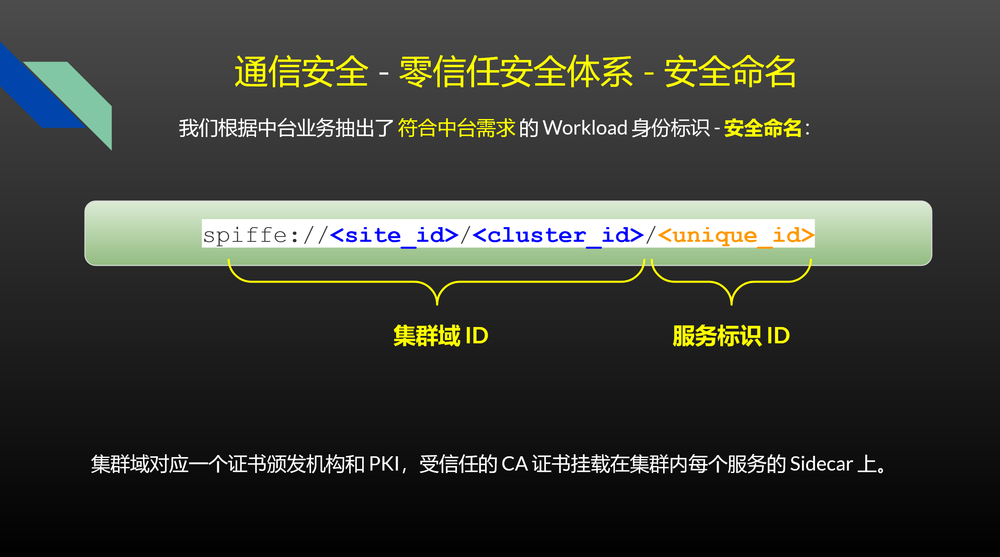
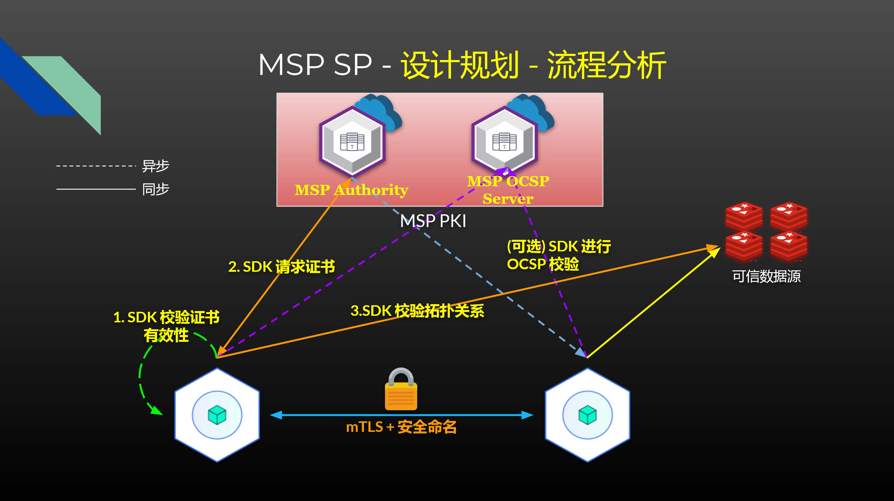
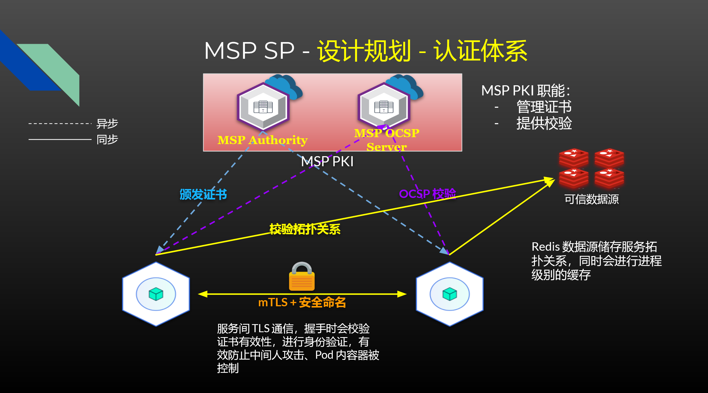
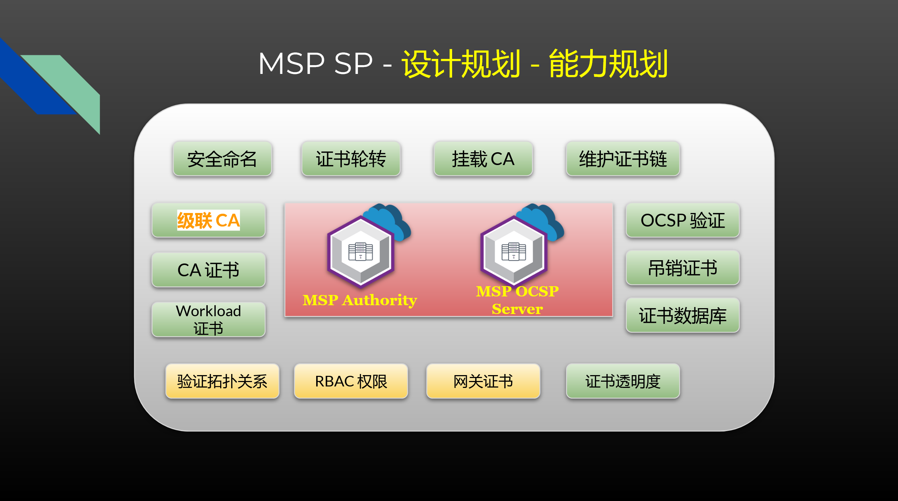

# CApitaliZone

## 一、概述 

Capitalizone 是基于 cfssl 的 package 开发的 CA 组件。

Security Provider 包括以下组件：

1. Capitalizone Server，作为 CA 中心
2. CaClient package，Golang SDK
3. （Optional）CaNodeAgent，承载证书管理的二进制文件

### 1.1 CA 证书管理

Root 证书以及集群 CA 证书存放于 [bifrost/CA](https://gitlab.oneitfarm.com/bifrost/deploy_scripts/tree/master/CA) 仓库。

包含文件：

1. Root 证书、私钥
2. 集群 CA 证书、私钥
3. 证书生成 Shell 脚本

### 1.2 SDK 接入

#### 1.2.1 Server

```go
import (
	"github.com/pkg/errors"
	"gitlab.oneitfarm.com/bifrost/capitalizone/pkg/caclient"
	"gitlab.oneitfarm.com/bifrost/capitalizone/pkg/spiffe"
)

// mTLS Server 使用示例
func NewSidecarMTLSServer() error {
    // role: Sidecar, Gateway, Standalone
    // CA Server 地址，K8s 集群内填写 https://capitalizone-tls.msp:8081
    // Ocsp Server 地址，K8s 集群内填写 http://capitalizone-ocsp.msp:8082
	// CA Auth Key, 通过部署时环境变量获取
	// Sign Algo 指定证书算法
	c := caclient.NewCAI(
        caclient.WithCAServer(caclient.RoleSidecar, *caAddr),
        aclient.WithOcspAddr(*ocspAddr),
        caclient.WithSignAlgo(keygen.Sm2SigAlg),
        caclient.WithAuthKey(authKey),
	)
    // 填写 Workload 参数
   serverEx, err := c.NewExchanger(&spiffe.IDGIdentity{
      SiteID:    "test_site",
      ClusterID: "cluster_test",
      UniqueID:  "client1",
   })
   if err != nil {
      return errors.Wrap(err, "Exchanger 初始化失败")
   }
    // 获取 tls.Config
   tlsCfg, err := serverEx.ServerTLSConfig()
   go func() {
      // Handle with tls.Config
      httpsServer(tlsCfg)
   }()
   // 启动证书轮换
   go serverEx.RotateController().Run()
   return nil
}
```

#### 1.2.2 Client

```go
import (
	"github.com/pkg/errors"
	"gitlab.oneitfarm.com/bifrost/capitalizone/pkg/caclient"
	"gitlab.oneitfarm.com/bifrost/capitalizone/pkg/spiffe"
)

// mTLS Client 使用示例
func NewSidecarMTLSClient() (*http.Client, error) {
    // role: Sidecar, Gateway, Standalone
	// CA Server 地址，K8s 集群内填写 https://capitalizone-tls.msp:8081
	// Ocsp Server 地址，K8s 集群内填写 http://capitalizone-ocsp.msp:8082
	// CA Auth Key, 通过部署时环境变量获取
	// Sign Algo 指定证书算法
	c := caclient.NewCAI(
        caclient.WithCAServer(caclient.RoleSidecar, *caAddr),
        aclient.WithOcspAddr(*ocspAddr),
        caclient.WithAuthKey(authKey),
        caclient.WithSignAlgo(keygen.Sm2SigAlg),
	)
    // 填写 Workload 参数
   serverEx, err := c.NewExchanger(&spiffe.IDGIdentity{
      SiteID:    "test_site",
      ClusterID: "cluster_test",
      UniqueID:  "client1",
   })
   if err != nil {
      return nil, errors.Wrap(err, "Exchanger 初始化失败")
   }
    // 获取 tls.Config
    // Server Name 可以为 "", 服务间调用默认不填写
   tlsCfg, err := serverEx.ClientTLSConfig("")
    // Handle With tls.Config
   client := httpClient(tlsCfg)
   // 启动证书轮换
   go serverEx.RotateController().Run()
   return client, nil
}
```

## 二、技术细节

### 2.1 证书管理

#### 2.1.1 自签证书

##### 2.1.1.1 自签 Root 证书

**Root 证书** 跨越所有的 Site，是集群信任的根证书。（它的效果与 System Cert Pool 中的证书等效。）

通过 Root 证书签发各 Site 下 CA 证书。

证书签发方式：

```bash
#!/bin/bash

cfssl gencert -initca ca.json | cfssljson -bare ca
```

`ca.json` 内容：

```json
{
  "key": {
    "algo": "rsa",
    "size": 4096
  },
  "names": [
    {
      "OU": "CI123 Root CA"
    }
  ],
  "ca": {
    "expiry": "175200h"
  }
}
```

部署方式：

2. Root 密钥及公钥储存到 Git 仓库

##### 2.1.1.2 自签 CA 证书

证书签发方式：

```bash
#!/bin/bash

cfssl gencert -initca ca.json | cfssljson -bare ca

rm -rf ca.pem

cfssl sign -ca ../RootCA/ca.pem -ca-key ../RootCA/ca-key.pem -config config.json ca.csr | cfssljson -bare ca
```

`ca.json` 内容：

```json
{
  "CN": "Site-Prod SP CA",
  "key": {
    "algo": "rsa",
    "size": 4096
  },
  "names": [
    {
      "OU": "Site-Prod SP CA",
      "L": "spiffe://sal2/aliyun-sh-prod"
    }
  ],
  "ca": {
    "expiry": "175200h"
  }
}
```

`config.json` 内容：

```json
{
  "signing": {
    "default": {
      "usages": [
        "digital signature",
        "cert sign",
        "crl sign"
      ],
      "ca_constraint": {
        "is_ca": true
      },
      "expiry": "43800h"
    }
  }
}
```

#### 2.1.2 CA 公钥挂载

Root CA 以及集群 CA 需要公开自身的公钥，Workload 服务需要加载公钥到 Trust Store，用于验证证书有效性。

Root CA 需要被所有的服务信任，即**所有的服务都需要挂载 Root CA 证书**。

Root CA 证书挂载方式：

1. 通过集群 CA 挂载 Root CA 证书，服务调用 CA SDK 时一并返回；
2. <del>挂载至 K8s 集群，VM 场景下不兼容</del>

集群 CA 挂载 Root CA 方式：

1. Root CA 公钥作为 ConfigMap 挂载在 Capitalizone 容器的目录下
2. 将 Root CA 证书路径作为启动参数，Capitalizone 启动时读取

服务挂载集群 CA 以及 Root CA 证书方式：

1. 调用集群 CA API 获取（HTTP），获取 CA 证书 API 不对公网暴露

#### 2.1.3 (TODO) 对接 MSP

1. 展示自身运行状态（数据需要开发）
2. 展示本集群下签发的所有证书
3. 提供吊销证书的接口

### 2.2 部署方式

*Capitalizone Server* 部署在 K8s 集群中，以实现高可用与负载均衡。

储存依靠 MySQL 5.7，存放签发的证书信息，以及 OCSP 返回值。

#### 2.2.1 网络环境

默认情况下 *Capitalizone Server* 不对公网开放，只负责自身所在集群的 mTLS 证书发放。

它服务的对象有：

1. Sidecar
2. 网关
3. 其他程序

对象能够处于 K8s 或 VM 环境中。

为了贯彻安全策略，*Capitalizone Server* 与其服务对象的通信需要进行加密，但为发放 mTLS 证书之前，无法进行密钥协商。

因此在 *Capitalizone Server*与其服务对象的通信，采取**单向 TLS 通信**，即客户端不验证服务端证书有效性。能够保障证书传输是加密的。

#### 2.2.2 证书文件挂载

Root 证书和 CA 证书需要挂载到 Capitalizone Server 的目录下进行解析运行。

需要挂载的文件：

1. Root 证书
2. CA 证书
3. CA 私钥

通过 K8s ConfigMap 在部署时创建，挂载在程序容器的目录下。

### 2.3 CapClient SDK

1. 证书轮转
2. TLS Server 证书热更新
3. (TODO) OCSP 验证实现

### 2.4 网关 mTLS

考虑两个问题：

1. 创建网关 Client TLS 证书、私钥
2. 挂载网关 Client TLS 证书

#### 2.4.1 创建网关证书

Kong 能够通过创建一个 Certificate 资源，储存自己的 Cert 和 Private Key。



流程：

1. KIC 使用 Capitalizone pkg，生成、获取证书
2. 将证书和 Key 储存到 Kong 的 Cert 资源中

#### 2.4.2 挂载证书

Kong 背后的服务，并不完全是 Sidecar，只有在启用 mTLS 的 Sidecar 上我们才会使用 mTLS 通信。

**默认所有 Sidecar 到 Kong 都使用 mTLS**。

控制方式：

1. 通过 Ingress 注解 "true" / "false" 获取是否启用 mTLS
2. （不确定）通过 Redis 查询是否启用 mTLS

启用 mTLS 的 Sidecar 通过配置 Kong Service 的 Certificate ID 参数实现 Client Certificate 传输。



#### 2.4.3 TrustStore

```
KONG_NGINX_PROXY_PROXY_SSL_VERIFY="on"
KONG_NGINX_PROXY_PROXY_SSL_VERIFY_DEPTH="3"
KONG_NGINX_PROXY_PROXY_SSL_TRUSTED_CERTIFICATE="/path/to/ca_certs.pem"
```



默认情况下 Nginx 不启用双向 TLS 认证，即不**验证服务器证书**。

## 三、设计



### 3.1 证书签发



X.509 证书广泛用于云原生生态的组件中，例如 *Etcd*、*Kubernetes*、*Istio*。

*Istio* 使用 TLS 证书扩展字段 `SAN` 标记 Pod 对应的 *Service Account* 信息。

*Kubernetes* 使用 TLS 证书 `CN` 作为服务名称，`O` 作为 *Namespace*，用于 RBAC 权限认证的标识。

### 3.2 CA 中心



Istio 的 CA 中心 *Citadel*，能够通过 SDS 协议发放/更新证书，在 Kubernetes 中通过 CRD 资源挂载生成的证书和私钥。

其工作模式为内部启用 go-client Informer，监听 ServiceAccount 资源变化，维护每个 SerivceAccount 对应的 TLS 证书和私钥。

业界能够作为参考的 CA 中心有 ***cfssl***，*Coredns*、*Istio* 等多个项目推荐使用其作为 CA 证书、CSR、证书签发工具，它支持多 CA 模式、提供 HTTP 接口等。

### 3.3 认证



对外提供服务的场景下，例如 API 接口、静态页面对外提供服务，使用 HTTPS 单向 TLS 加密，服务不需要验证客户端身份。

双向 TLS（mTLS）通信运用在 *Kubernetes* 集群内部通信中，*Istio* 组件间的通信中，以及 *Etcd* 可以开启双向 TLS 认证来保障通信安全。

双向 TLS 适用场景：

- 服务间调用
- Pod-to-Pod 通信加密
- *Sidecar* 与跨 *Site Proxy* 之间通信
- *Site Proxy* 跨集群互相通信
- ...

### 3.4 设想路线



中台业务下的当前架构，内部服务之间调用几乎完全是通过明文 HTTP 通信，缺乏安全保障。

公网流量中，组件与 Etcd 之间的通信是单向 TLS 加密（没有 CA，不验证证书有效性）+ 启用账号认证，Sidecar Proxy 与其他集群网关之间的通信也是单向 TLS 加密。

现阶段最缺乏的是统一的 CA 中心，颁发用于双向 TLS 认证的证书，需要健全 CA 中心在 Kubernetes 和虚拟机环境下的证书签发和证书发现能力。

参考 *Citadel* 需要实现的 **CA 基础服务能力**有：

- 支持扩展字段的证书签发
- API 接口支持 CSR 签发证书
- 证书在 Kubernetes （Istio 中挂载到 CRD）与虚拟机中的挂载（Istio 组件通过 SDS 协议储存在内存中）
- 证书的自动定期续约

借助 CA 的能力，进一步实现 Pod-to-Pod 级别的服务安全通信，需要借助 Mesh 体系下 Sidecar 的能力，通过 Sidecar 加载证书和密钥，互相认证建立 TLS 通信，使中台内部服务调用全部通过 TLS 通信加密，保障内部服务安全。

同时可以使与 Etcd 之间的通信也使用双向 TLS 通信。

跨集群调用模式中，原来借助网关实现的单向 TLS 通信，也能够替换成 Sidecar Proxy 与 Sidecar Proxy 之间通过双向 TLS 通信加密，其中网关需要关闭 TLS 终止，也就是需要开启 TLS 透传。*其中多集群间 CA 证书数据需要同步，CA 中心的跨集群模式还需要进一步规划。*